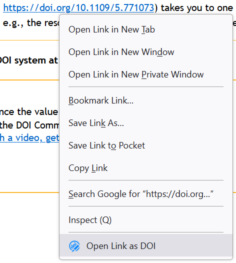

<!--
SPDX-FileCopyrightText: 2022-2023 Benjamin Collet <benjamin.collet@protonmail.ch>

SPDX-License-Identifier: CECILL-2.1
-->

# Custom DOI resolver <!--  -->

A browser extention that redirect DOIs to a user defined resolver.

## Development

### Scripts to Rule Them All

* `script/setup` - sets up the project to be used for the first time
* `script/server` - starts app

## License

[CeCILL version 2.1](https://cecill.info/licences/Licence_CeCILL_V2.1-en.html) (GPL compatible license under French law).
